# System Diagrams - EduBot
## DFD, ERD, and UML Diagrams

Comprehensive collection of system diagrams for the EduBot AI-powered learning platform.

---

## Table of Contents

1. [Data Flow Diagram (DFD)](#data-flow-diagram-dfd)
2. [Entity Relationship Diagram (ERD)](#entity-relationship-diagram-erd)
3. [UML Class Diagram](#uml-class-diagram)
4. [UML Sequence Diagrams](#uml-sequence-diagrams)
5. [UML Use Case Diagram](#uml-use-case-diagram)
6. [UML Component Diagram](#uml-component-diagram)

---

## Data Flow Diagram (DFD)

### Level 0 - Context Diagram

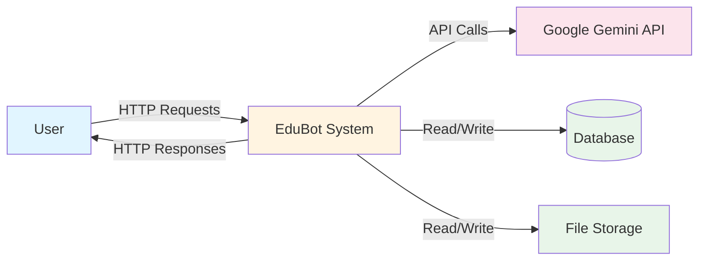

### Level 1 - System Decomposition

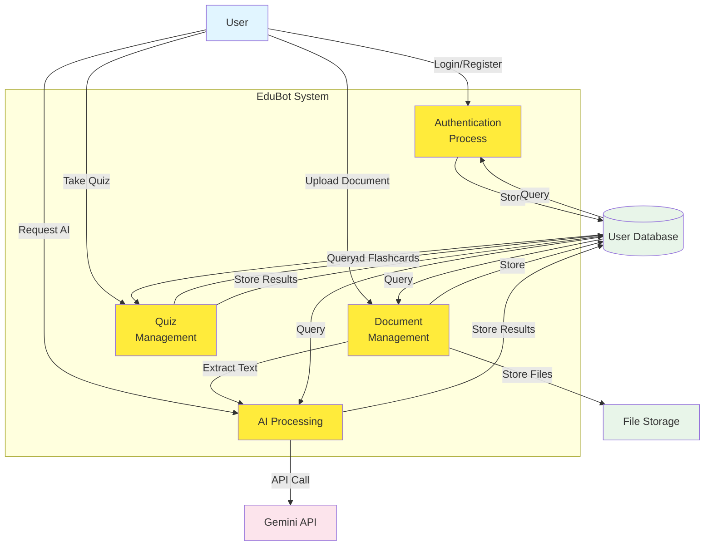

### Level 2 - Detailed Process Flow

#### Document Upload Process

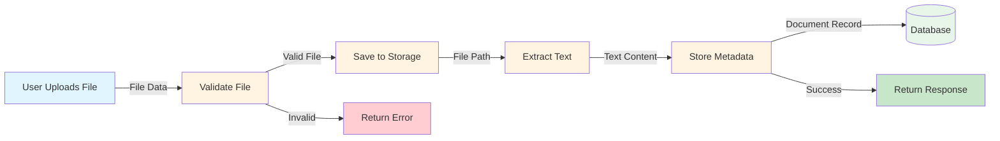

#### AI Processing Flow

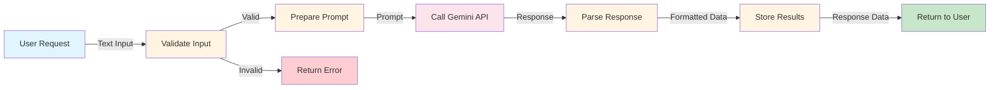

---

## Entity Relationship Diagram (ERD)

### Complete ERD

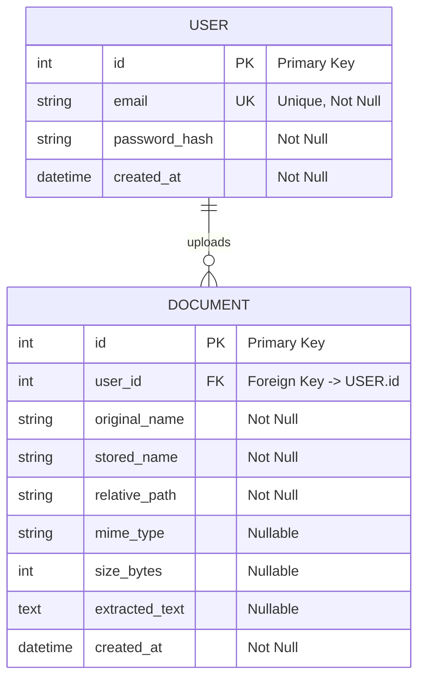

### Detailed ERD with Attributes

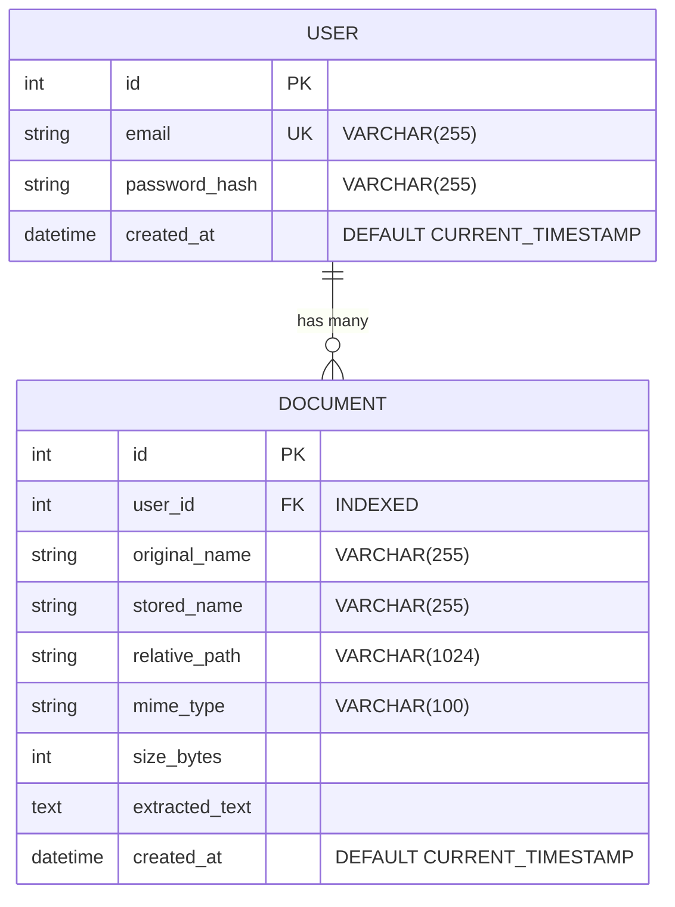

### Relationship Details

- **Cardinality**: One-to-Many (One User can have many Documents)
- **Foreign Key**: `DOCUMENT.user_id` → `USER.id`
- **Constraint**: Documents are deleted when user is deleted (application-level)
- **Index**: `user_id` is indexed for faster queries

---

## UML Class Diagram

### Backend Classes

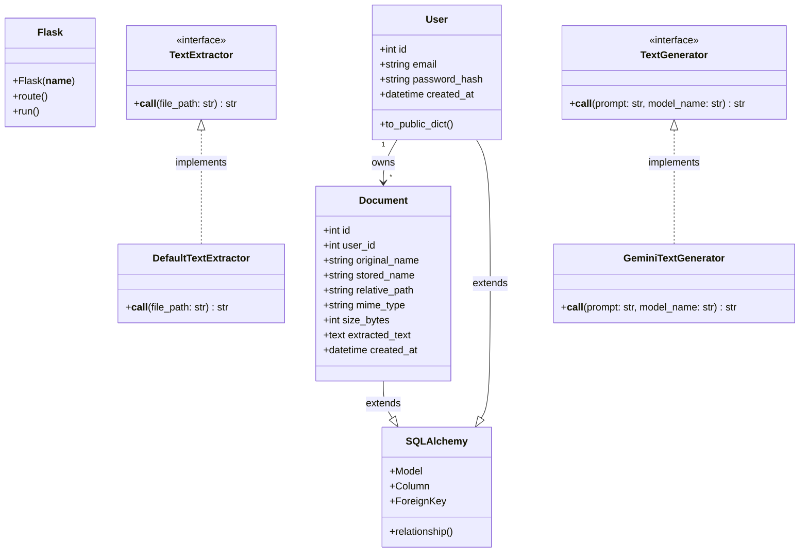

### Frontend Classes

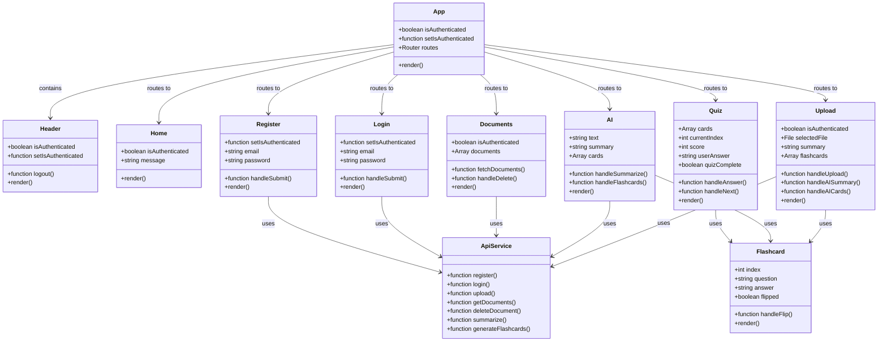

---

## UML Sequence Diagrams

### User Registration Sequence

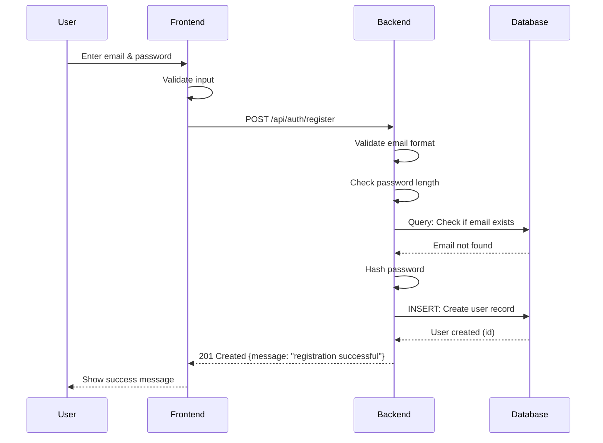

### Document Upload Sequence

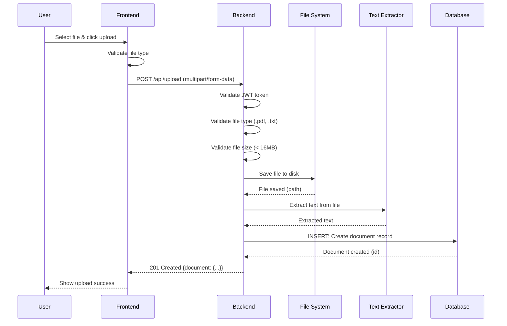

### AI Summary Generation Sequence

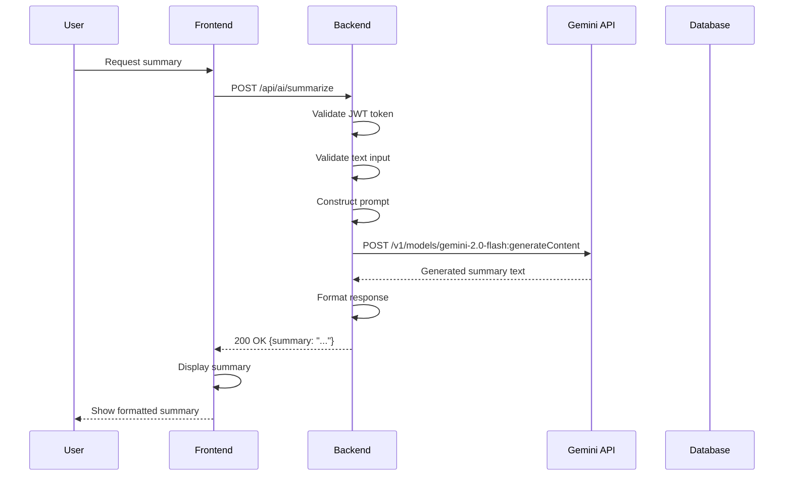

### Quiz Mode Sequence

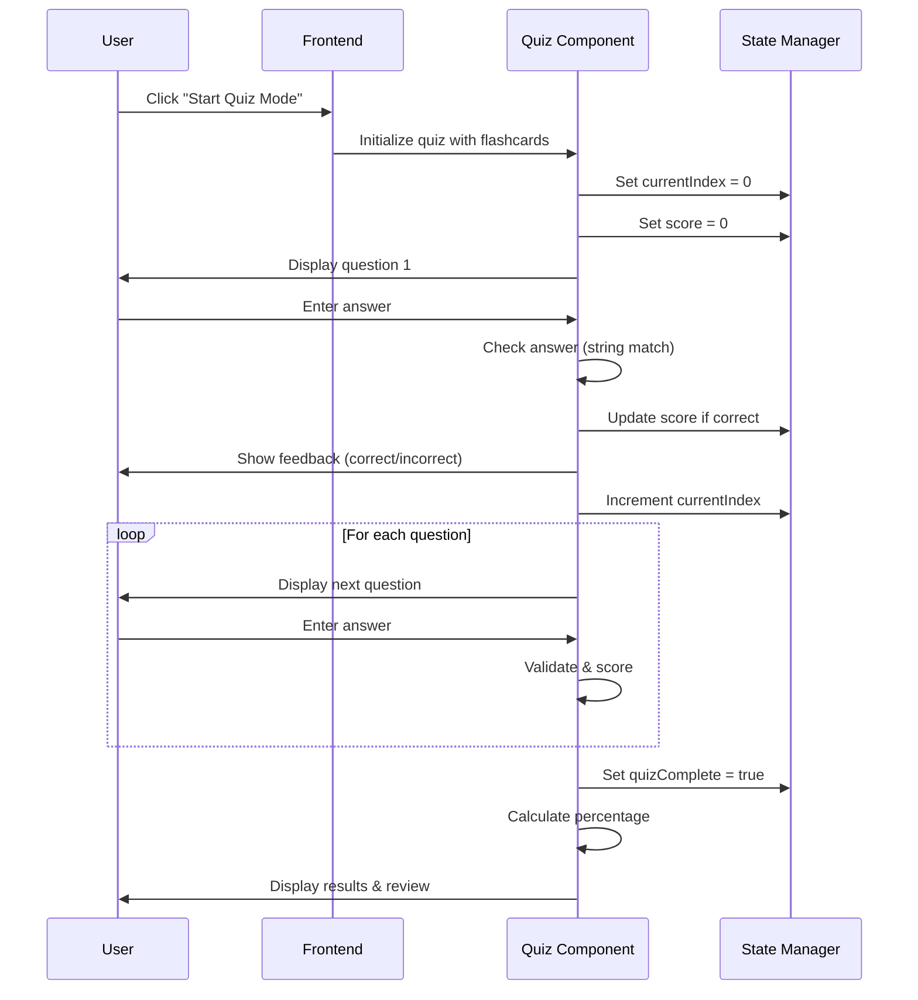

---

## UML Use Case Diagram

### Complete Use Case Diagram

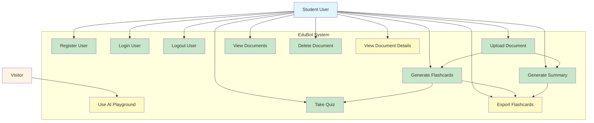

### Detailed Use Case Diagram

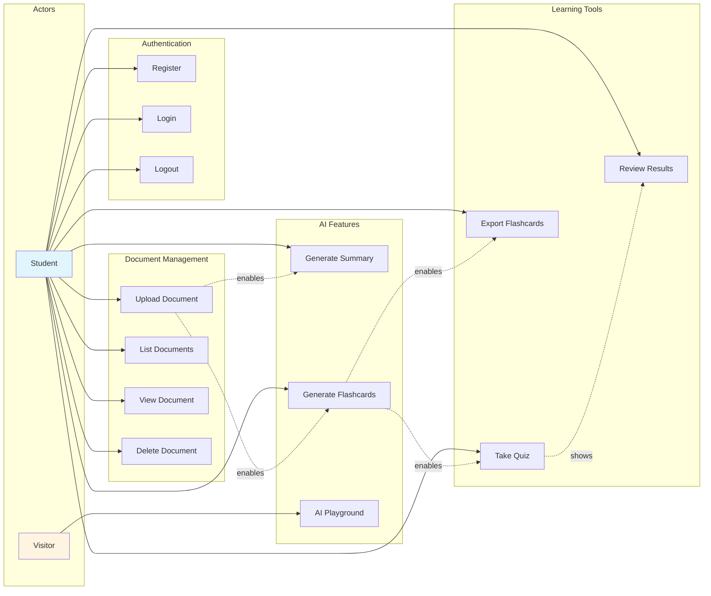

---

## UML Component Diagram

### System Components

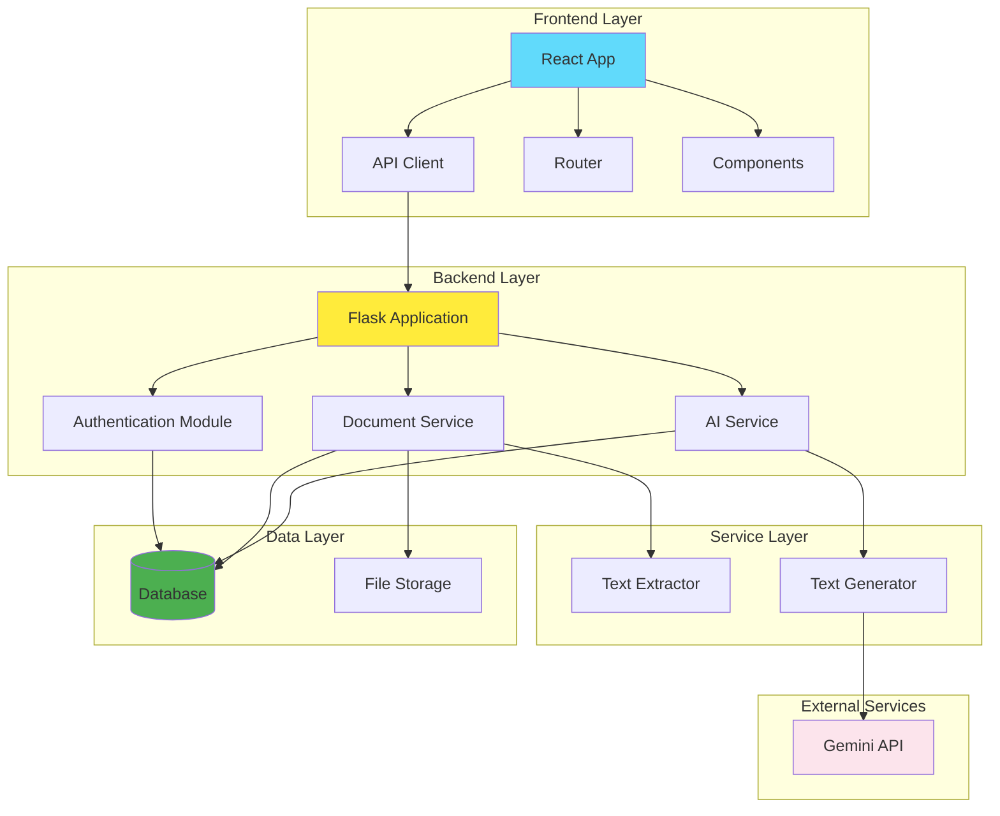

### Detailed Component Diagram

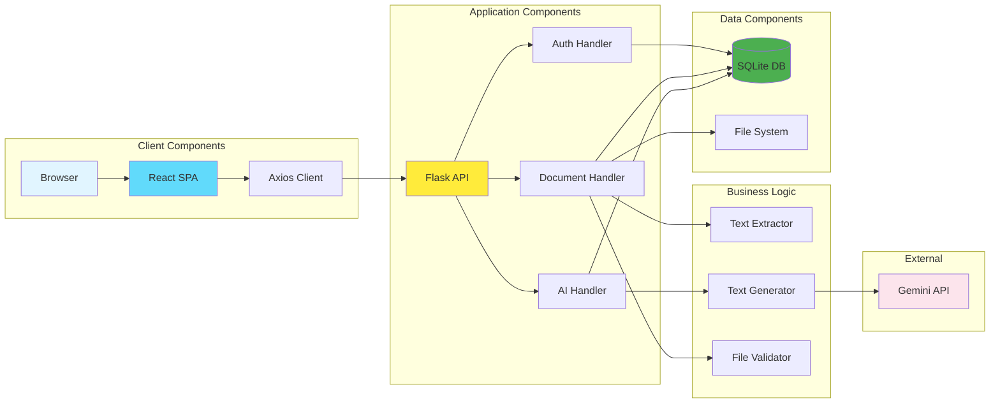

---

## Diagram Summary

### DFD (Data Flow Diagram)
- **Level 0**: Context diagram showing external entities
- **Level 1**: System decomposition into major processes
- **Level 2**: Detailed process flows for document upload and AI processing

### ERD (Entity Relationship Diagram)
- **Entities**: User, Document
- **Relationship**: One-to-Many (User → Documents)
- **Attributes**: All fields with types and constraints
- **Keys**: Primary keys, foreign keys, unique constraints

### UML Diagrams
1. **Class Diagram**: Backend and Frontend classes with relationships
2. **Sequence Diagrams**: 
   - User Registration
   - Document Upload
   - AI Summary Generation
   - Quiz Mode
3. **Use Case Diagram**: All system use cases with actors
4. **Component Diagram**: System components and their interactions

---

## Diagram Usage

### For Documentation
- Include in project report
- Use for system documentation
- Reference in architecture documentation

### For Presentation
- Export diagrams as images
- Use in slides
- Include in project demos

### For Development
- Guide implementation
- Understand system structure
- Plan new features

---

## Tools for Rendering

All diagrams use **Mermaid** syntax and can be rendered in:
- **GitHub/GitLab**: Native markdown support
- **VS Code**: Mermaid extension
- **Online**: https://mermaid.live/
- **Documentation**: MkDocs, Docusaurus, etc.

### Exporting as Images

1. Copy Mermaid code
2. Go to https://mermaid.live/
3. Paste code
4. Export as PNG/SVG
5. Include in documents

---

## Diagram Relationships

```
DFD (Data Flow)
    ↓
ERD (Data Structure)
    ↓
UML Class Diagram (Code Structure)
    ↓
UML Sequence Diagram (Process Flow)
    ↓
UML Use Case Diagram (User Interactions)
    ↓
UML Component Diagram (System Architecture)
```

All diagrams are interconnected and provide different perspectives of the same system.

---

**Document Status:** Complete  
**Last Updated:** November 2025  
**Version:** 1.0

