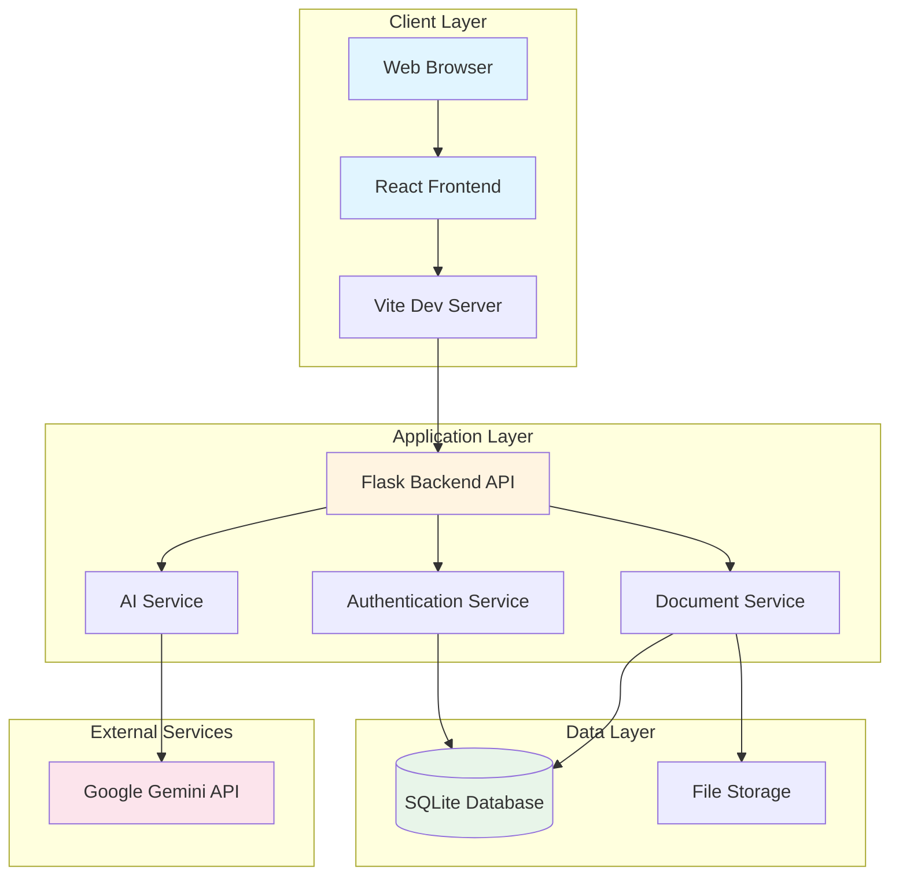
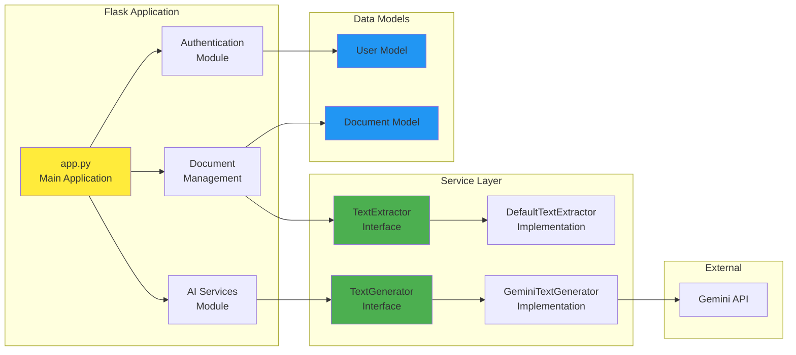
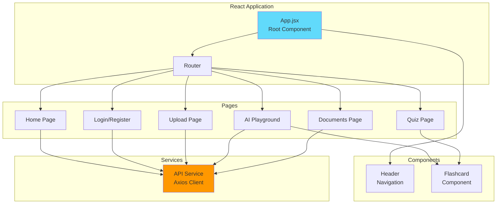
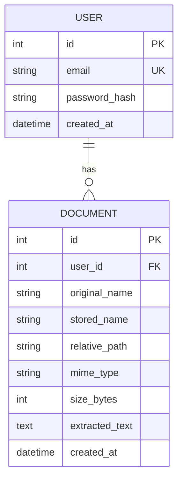
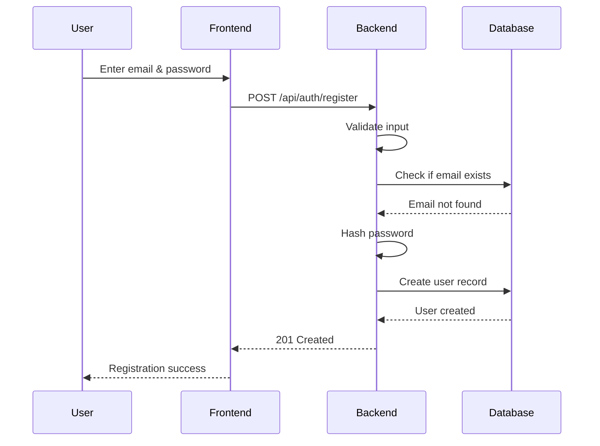
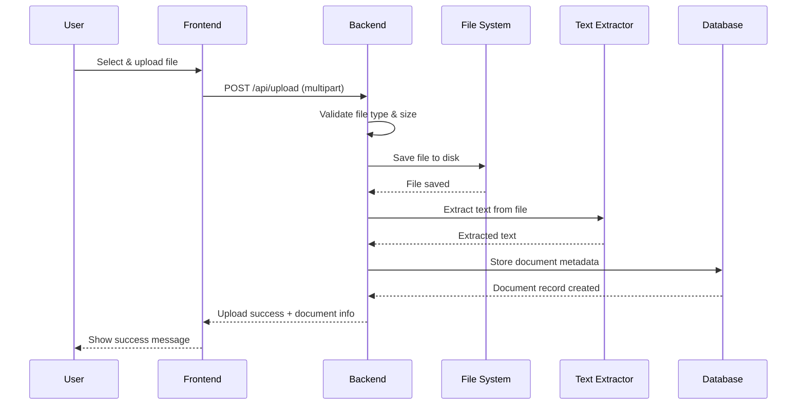
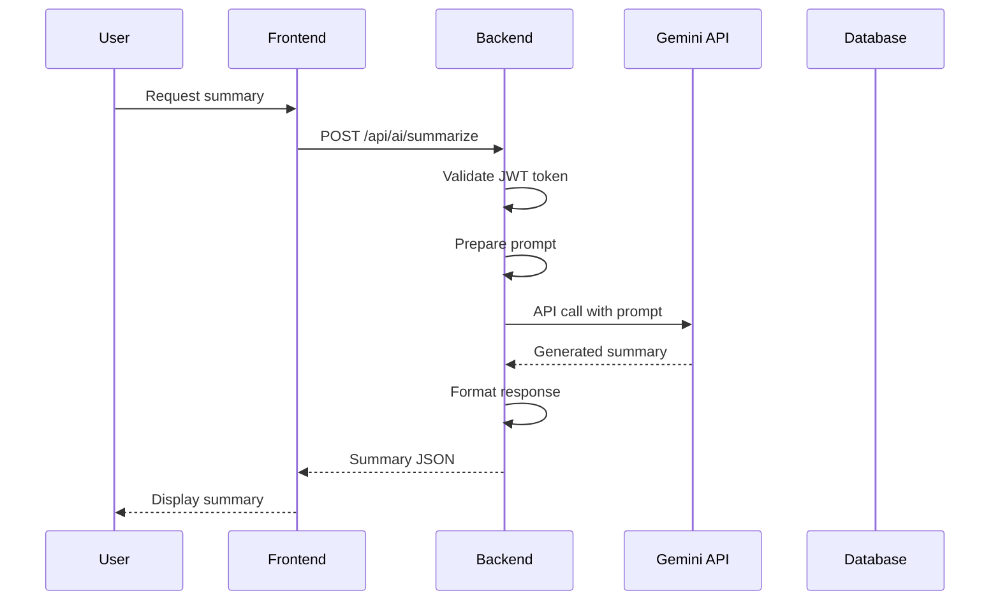
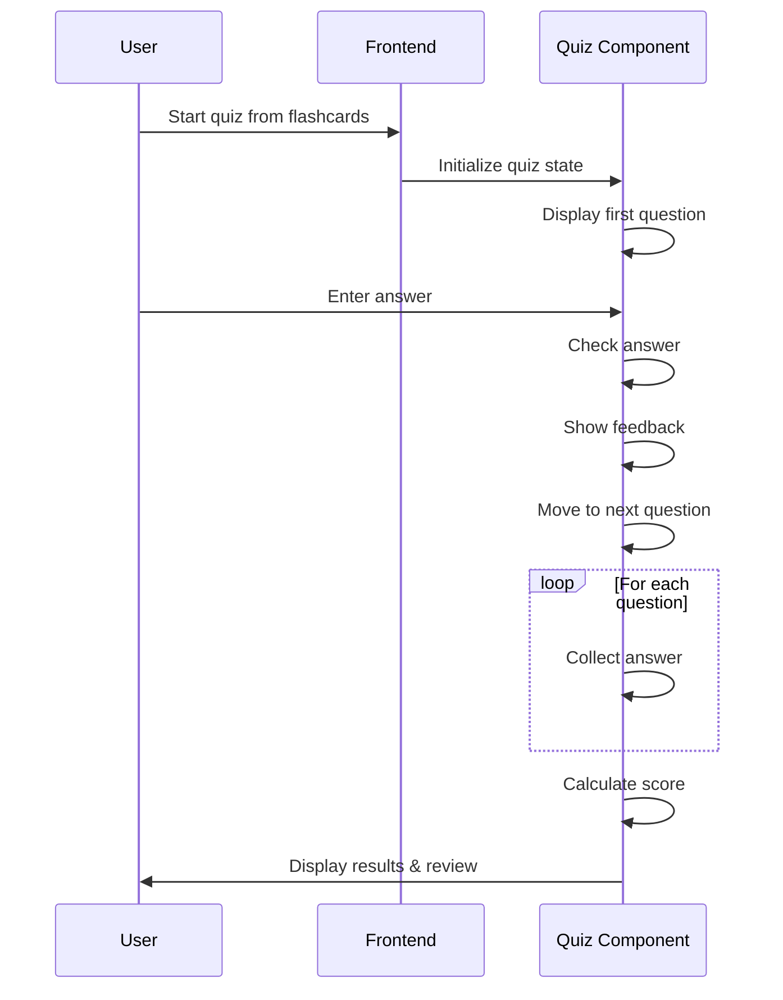
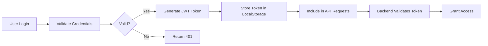
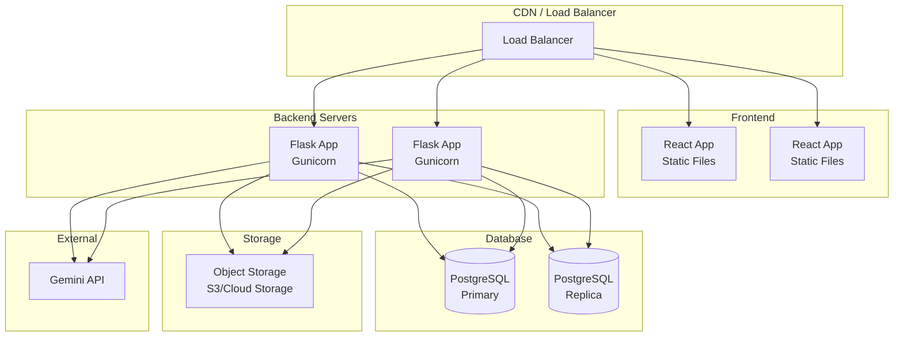

# System Architecture and Design - EduBot

Comprehensive system architecture and design documentation for the EduBot AI-powered learning platform.

---

## Table of Contents

1. [System Overview](#system-overview)
2. [High-Level Architecture](#high-level-architecture)
3. [Component Architecture](#component-architecture)
4. [Database Design](#database-design)
5. [API Design](#api-design)
6. [Data Flow Diagrams](#data-flow-diagrams)
7. [Technology Stack](#technology-stack)
8. [Security Architecture](#security-architecture)
9. [Deployment Architecture](#deployment-architecture)
10. [Design Patterns](#design-patterns)

---

## System Overview

EduBot is a full-stack web application that combines document processing, AI-powered content generation, and interactive learning tools. The system follows a client-server architecture with a React frontend and Flask backend, integrated with Google Gemini AI for intelligent content generation.

### Key Characteristics

- **Architecture Pattern**: Client-Server (3-Tier Architecture)
- **Communication Protocol**: RESTful API over HTTP/HTTPS
- **Authentication**: JWT (JSON Web Tokens)
- **Database**: SQLite (development) / PostgreSQL (production-ready)
- **AI Integration**: Google Gemini API
- **File Storage**: Local filesystem (development) / Cloud storage (production-ready)

---

## High-Level Architecture

### System Architecture Diagram



### 3-Tier Architecture

```
┌─────────────────────────────────────────┐
│         PRESENTATION TIER               │
│  React.js + Vite (Frontend)            │
│  - User Interface                       │
│  - Client-side Routing                  │
│  - State Management                     │
└─────────────────────────────────────────┘
                    ↕ HTTP/REST API
┌─────────────────────────────────────────┐
│         APPLICATION TIER                │
│  Flask (Backend)                        │
│  - Business Logic                       │
│  - Authentication & Authorization       │
│  - API Endpoints                        │
│  - AI Integration                       │
└─────────────────────────────────────────┘
                    ↕ ORM (SQLAlchemy)
┌─────────────────────────────────────────┐
│         DATA TIER                       │
│  SQLite Database                        │
│  File Storage System                    │
│  External AI Service (Gemini)           │
└─────────────────────────────────────────┘
```

---

## Component Architecture

### Backend Component Diagram



### Frontend Component Diagram



---

## Database Design

### Entity Relationship Diagram



### Database Schema

#### Users Table

| Column | Type | Constraints | Description |
|--------|------|-------------|-------------|
| `id` | INTEGER | PRIMARY KEY, AUTO_INCREMENT | Unique user identifier |
| `email` | VARCHAR(255) | UNIQUE, NOT NULL | User email address |
| `password_hash` | VARCHAR(255) | NOT NULL | Hashed password (Werkzeug) |
| `created_at` | DATETIME | NOT NULL, DEFAULT CURRENT_TIMESTAMP | Account creation timestamp |

#### Documents Table

| Column | Type | Constraints | Description |
|--------|------|-------------|-------------|
| `id` | INTEGER | PRIMARY KEY, AUTO_INCREMENT | Unique document identifier |
| `user_id` | INTEGER | FOREIGN KEY (users.id), NOT NULL, INDEXED | Owner user reference |
| `original_name` | VARCHAR(255) | NOT NULL | Original filename |
| `stored_name` | VARCHAR(255) | NOT NULL | Secure stored filename |
| `relative_path` | VARCHAR(1024) | NOT NULL | File system path |
| `mime_type` | VARCHAR(100) | NULLABLE | File MIME type |
| `size_bytes` | INTEGER | NULLABLE | File size in bytes |
| `extracted_text` | TEXT | NULLABLE | Extracted text content |
| `created_at` | DATETIME | NOT NULL, DEFAULT CURRENT_TIMESTAMP | Upload timestamp |

### Relationships

- **One-to-Many**: One User can have many Documents
- **Foreign Key Constraint**: Documents.user_id → Users.id
- **Cascade Behavior**: On user deletion, documents are handled by application logic

---

## API Design

### RESTful API Endpoints

#### Authentication Endpoints

| Method | Endpoint | Description | Auth Required |
|--------|----------|-------------|---------------|
| `POST` | `/api/auth/register` | Register new user | No |
| `POST` | `/api/auth/login` | User login | No |
| `GET` | `/api/me` | Get current user info | Yes |

#### Document Endpoints

| Method | Endpoint | Description | Auth Required |
|--------|----------|-------------|---------------|
| `POST` | `/api/upload` | Upload document | Yes |
| `GET` | `/api/documents` | List user documents | Yes |
| `GET` | `/api/documents/<id>` | Get document details | Yes |
| `DELETE` | `/api/documents/<id>` | Delete document | Yes |

#### AI Endpoints

| Method | Endpoint | Description | Auth Required |
|--------|----------|-------------|---------------|
| `POST` | `/api/ai/summarize` | Generate text summary | Yes |
| `POST` | `/api/ai/flashcards` | Generate flashcards | Yes |
| `POST` | `/api/ai/generate` | General AI generation | Yes |

#### Public Endpoints

| Method | Endpoint | Description | Auth Required |
|--------|----------|-------------|---------------|
| `GET` | `/api/hello` | Health check | No |

### API Request/Response Examples

#### Register User

**Request:**
```http
POST /api/auth/register
Content-Type: application/json

{
  "email": "user@example.com",
  "password": "securepassword123"
}
```

**Response (Success):**
```json
{
  "message": "registration successful"
}
```
Status: `201 Created`

**Response (Error):**
```json
{
  "error": "email already registered"
}
```
Status: `409 Conflict`

#### Upload Document

**Request:**
```http
POST /api/upload
Authorization: Bearer <jwt_token>
Content-Type: multipart/form-data

file: <binary data>
```

**Response:**
```json
{
  "message": "file uploaded successfully",
  "document": {
    "id": 1,
    "original_name": "lecture.pdf",
    "mime_type": "application/pdf",
    "size_bytes": 245678,
    "extracted_text_length": 1234
  }
}
```

#### Generate Summary

**Request:**
```http
POST /api/ai/summarize
Authorization: Bearer <jwt_token>
Content-Type: application/json

{
  "text": "Long text content here..."
}
```

**Response:**
```json
{
  "summary": "• Key point 1\n• Key point 2\n• Key point 3"
}
```

---

## Data Flow Diagrams

### User Registration Flow



### Document Upload and Processing Flow



### AI Summary Generation Flow



### Quiz Mode Flow



---

## Technology Stack

### Frontend Stack

| Technology | Version | Purpose |
|------------|---------|---------|
| **React** | 18.x | UI framework |
| **React Router** | 6.x | Client-side routing |
| **Vite** | 7.x | Build tool & dev server |
| **Axios** | Latest | HTTP client |
| **CSS3** | - | Styling with custom properties |

### Backend Stack

| Technology | Version | Purpose |
|------------|---------|---------|
| **Python** | 3.12 | Programming language |
| **Flask** | 3.x | Web framework |
| **SQLAlchemy** | 2.x | ORM |
| **Flask-JWT-Extended** | 4.x | JWT authentication |
| **Werkzeug** | 3.x | Security utilities |
| **PyPDF2** | Latest | PDF text extraction |

### Database & Storage

| Technology | Purpose |
|------------|---------|
| **SQLite** | Development database |
| **File System** | Document storage |

### External Services

| Service | Purpose |
|---------|---------|
| **Google Gemini API** | AI text generation |

### Development Tools

| Tool | Purpose |
|------|---------|
| **pytest** | Testing framework |
| **mutmut** | Mutation testing |
| **Git** | Version control |

---

## Security Architecture

### Authentication Flow



### Security Measures

1. **Password Security**
   - Passwords hashed using Werkzeug's `generate_password_hash`
   - Uses PBKDF2 with SHA-256
   - Minimum 8 characters required

2. **JWT Authentication**
   - Tokens stored in HTTP-only cookies (production)
   - Token expiration handled
   - Secure token validation on each request

3. **API Security**
   - Protected endpoints require JWT
   - User ownership validation for resources
   - Input validation and sanitization

4. **File Upload Security**
   - File type validation (whitelist)
   - File size limits (16MB)
   - Secure filename handling
   - Path traversal prevention

5. **CORS & Headers**
   - CORS configured for frontend origin
   - Security headers in production

### Security Layers

```
┌─────────────────────────────────┐
│   Transport Security (HTTPS)   │
├─────────────────────────────────┤
│   Authentication (JWT)          │
├─────────────────────────────────┤
│   Authorization (User Check)    │
├─────────────────────────────────┤
│   Input Validation              │
├─────────────────────────────────┤
│   SQL Injection Prevention      │
│   (SQLAlchemy ORM)              │
└─────────────────────────────────┘
```

---

## Deployment Architecture

### Development Architecture

```
┌──────────────┐
│   Developer  │
└──────┬───────┘
       │
       ▼
┌─────────────────────────────┐
│  Local Development Machine  │
│  ┌───────────────────────┐  │
│  │  React Dev Server     │  │
│  │  (localhost:5173)     │  │
│  └───────────────────────┘  │
│  ┌───────────────────────┐  │
│  │  Flask Backend        │  │
│  │  (localhost:5001)     │  │
│  └───────────────────────┘  │
│  ┌───────────────────────┐  │
│  │  SQLite Database      │  │
│  └───────────────────────┘  │
└─────────────────────────────┘
       │
       ▼
┌─────────────────────────────┐
│   Google Gemini API         │
│   (External Service)        │
└─────────────────────────────┘
```

### Production Architecture (Recommended)



### Deployment Components

1. **Frontend Deployment**
   - Build: `npm run build`
   - Output: Static files in `dist/`
   - Hosting: Nginx, Apache, or CDN (Cloudflare, AWS CloudFront)

2. **Backend Deployment**
   - WSGI Server: Gunicorn or uWSGI
   - Process Manager: systemd, Supervisor, or PM2
   - Reverse Proxy: Nginx

3. **Database**
   - Development: SQLite
   - Production: PostgreSQL or MySQL

4. **File Storage**
   - Development: Local filesystem
   - Production: AWS S3, Google Cloud Storage, or Azure Blob

---

## Design Patterns

### 1. Dependency Injection (DIP)

**Implementation:**
- `TextExtractor` and `TextGenerator` interfaces
- Concrete implementations injected at runtime
- Allows easy swapping of implementations

**Code Location:**
- `services/interfaces.py` - Protocol definitions
- `services/impl.py` - Implementations
- `app.py` - Dependency injection

### 2. Repository Pattern

**Implementation:**
- SQLAlchemy ORM abstracts database access
- Models encapsulate data operations
- Clean separation of data layer

### 3. RESTful API Pattern

**Implementation:**
- Resource-based URLs
- Standard HTTP methods
- Stateless communication
- JSON request/response format

### 4. Single Responsibility Principle (SRP)

**Implementation:**
- Separate modules for authentication, documents, AI
- Each service has a single responsibility
- Clear separation of concerns

### 5. Strategy Pattern

**Implementation:**
- Different text extraction strategies (PDF, TXT)
- Different AI generation strategies (Gemini, Mock)
- Interchangeable algorithms

---

## System Scalability Considerations

### Current Limitations

1. **Database**: SQLite is single-user, not suitable for production scale
2. **File Storage**: Local filesystem doesn't scale horizontally
3. **Session Management**: Stateless JWT allows horizontal scaling
4. **AI API**: External service handles scaling

### Scalability Improvements

1. **Database Migration**
   - Move to PostgreSQL for production
   - Implement connection pooling
   - Add read replicas for scaling reads

2. **File Storage**
   - Migrate to cloud object storage (S3)
   - Implement CDN for static assets

3. **Caching**
   - Add Redis for session caching
   - Cache AI responses
   - Cache frequently accessed documents

4. **Load Balancing**
   - Multiple backend instances
   - Load balancer for request distribution

5. **Microservices (Future)**
   - Separate authentication service
   - Separate document processing service
   - Separate AI service

---

## Performance Considerations

### Frontend Optimization

- Code splitting with React Router
- Lazy loading of components
- Asset optimization (Vite)
- Minimal bundle size

### Backend Optimization

- Database indexing on `user_id` in documents
- Connection pooling
- Async file processing (future)
- Response caching

### API Optimization

- Pagination for document lists
- Compression for large responses
- Efficient JSON serialization

---

## Monitoring & Logging

### Recommended Monitoring

1. **Application Metrics**
   - Request/response times
   - Error rates
   - API endpoint usage

2. **System Metrics**
   - CPU/Memory usage
   - Database connection pool
   - File storage usage

3. **Business Metrics**
   - User registrations
   - Document uploads
   - AI API usage

### Logging Strategy

- Structured logging (JSON format)
- Log levels (DEBUG, INFO, WARNING, ERROR)
- Centralized log aggregation
- Error tracking (Sentry, Rollbar)

---

## Conclusion

EduBot follows a modern, scalable architecture with clear separation of concerns:

- **Frontend**: React-based SPA with modern tooling
- **Backend**: RESTful Flask API with clean architecture
- **Database**: Relational model with proper relationships
- **Security**: JWT authentication with multiple security layers
- **AI Integration**: External service integration with fallback
- **Design Patterns**: SOLID principles and dependency injection

The architecture supports:
- ✅ Horizontal scaling (stateless design)
- ✅ Maintainability (clean code structure)
- ✅ Testability (dependency injection)
- ✅ Security (multiple security layers)
- ✅ Extensibility (interface-based design)

---

## Diagrams Summary

All diagrams in this document use **Mermaid** syntax and can be rendered in:
- GitHub/GitLab markdown
- Documentation tools (MkDocs, Docusaurus)
- Online Mermaid editors
- VS Code with Mermaid extension

For presentation, export diagrams as images or use Mermaid Live Editor: https://mermaid.live/


